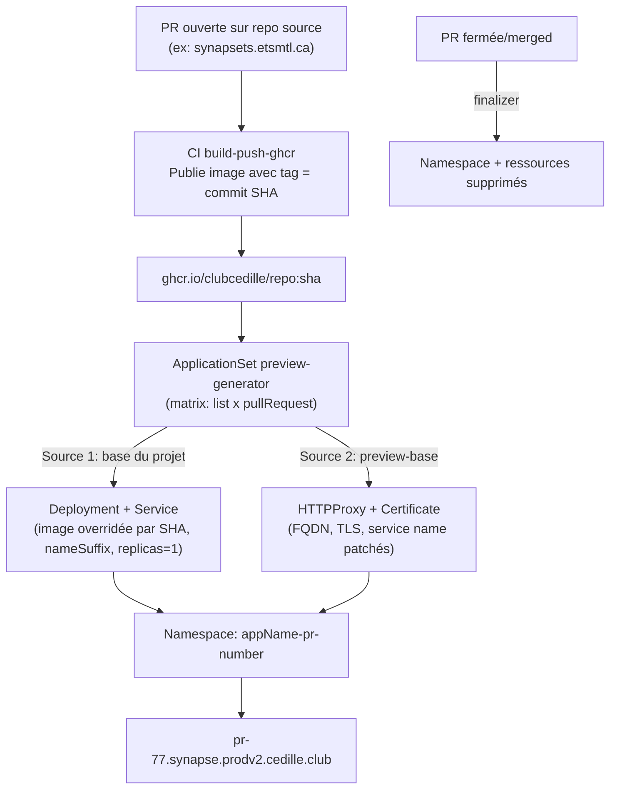

# PR Preview - Architecture et Guide

Systeme de preview automatique pour les PRs. Quand une PR est ouverte sur un
repo configuré, ArgoCD déploie automatiquement une instance preview accessible
via `pr-<number>.<domaine>.prodv2.cedille.club`. Quand la PR est fermée/merged,
le namespace et toutes les ressources sont nettoyés automatiquement.

## Architecture

Toute la config est dans `apps/preview-base/`.



### Multi-source

L'ApplicationSet utilise `sources` pour combiner deux sources
kustomize :

| Source | Path                                                 | Rôle                                                                                                                                   |
|--------|------------------------------------------------------|----------------------------------------------------------------------------------------------------------------------------------------|
| 1      | `basePath` du projet (ex: `apps/synapsets/web/base`) | Deployment + Service existants. Kustomize override l'image avec le SHA du commit, ajoute `-pr-<number>` comme suffix, force 1 replica. |
| 2      | `apps/preview-base`                                  | Template générique HTTPProxy + Certificate. Kustomize patche le FQDN, le TLS secret, et le nom du service dynamiquement.              |

Les manifests des deux sources sont déployés dans un namespace dédié
`<appName>-pr-<number>`.

## Ajouter un nouveau projet

1. Ajouter un élément dans la liste du `preview-generator.argoapp.yaml` :

   ```yaml
   - appName: mon-projet
     repo: mon-projet.etsmtl.ca        # nom du repo GitHub (pour le PR generator)
     previewDomain: mon-projet          # sous-domaine: pr-X.mon-projet.prodv2.cedille.club
     basePath: apps/mon-projet/base     # path vers le base kustomize du projet
     image: ghcr.io/clubcedille/mon-projet.etsmtl.ca  # image docker
     serviceName: mon-projet-service    # nom du Service dans le base
   ```

1. S'assurer que le repo source utilise notre CI réutilisable avec les params
   `pr-head-sha` et `pr-head-ref` :

   ```yaml
   # .github/workflows/deployment.yml dans le repo source
   name: Docker
   on:
     push:
       branches: [master]
     pull_request:
       branches: [master]
   jobs:
     build-push-ghcr:
       uses: ClubCedille/cedille-workflows/.github/workflows/build-push-ghcr.yaml@master
       with:
         container-name: ${{ github.event.repository.name }}
         pr-head-sha: ${{ github.event.pull_request.head.sha || '' }}
         pr-head-ref: ${{ github.event.pull_request.head.ref || '' }}
       secrets: inherit
   ```

## Supporter d'autres orgs GitHub

Présentement, le PR generator est hardcodé sur `owner: ClubCedille`. Pour
supporter d'autres orgs :

1. Ajouter `owner` comme champ dans les éléments de la liste :

   ```yaml
   - appName: projet-externe
     owner: AutreOrg          # nouveau champ
     repo: projet-externe
     ...
   ```

1. Changer le PR generator pour utiliser `'{{.owner}}'` au lieu de `ClubCedille` :

   ```yaml
   - pullRequest:
       github:
         owner: '{{.owner}}'
         repo: '{{.repo}}'
   ```

1. Le token GitHub (`github-pr-token`) doit avoir accès aux repos de l'autre
   org.
1. Le repo source doit publier ses images sur un registry accessible et utiliser
   la CI avec `pr-head-sha`.
